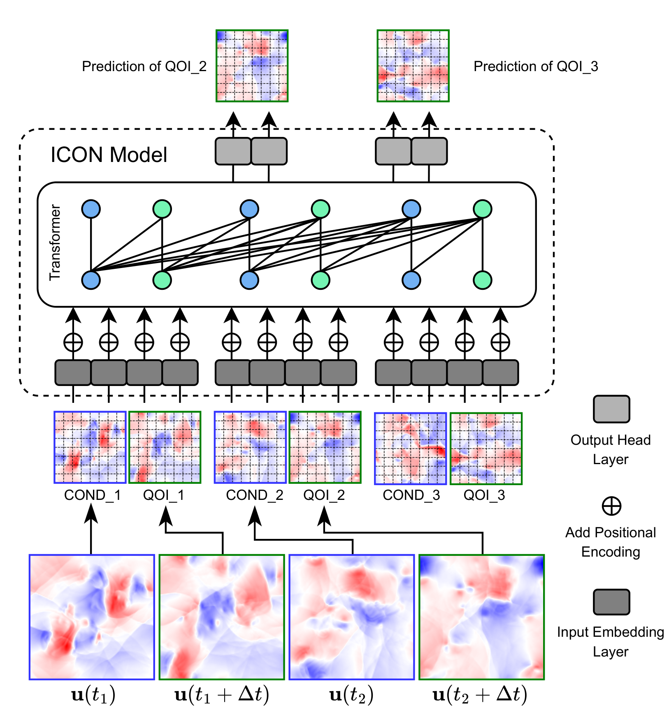

# VICON: Vision In-Context Operator Networks for Multi-Physics Fluid Dynamics

This repository contains the official implementation of [VICON: Vision In-Context Operator Networks for Multi-Physics Fluid Dynamics](https://arxiv.org/abs/2411.16063).

## Dataset preprocessing

We evaluated VICON on three fluid dynamics datasets:

- PDEArena-Incomp (incompressible Navier-Stokes)
- PDEBench-Comp-HighVis (compressible Navier-Stokes)
- PDEBench-Comp-LowVis (compressible NS with numerical-zero viscosity)

### 1. PDEBench Datasets

We split two distinct systems from PDEBench's 2D CFD dataset:

- Compressible flow with high viscosity: PDEBench-Comp-HighVis
- Compressible flow with low viscosity: PDEBench-Comp-LowVis

To download:

```bash
# Clone PDEBench repository
git clone https://github.com/pdebench/PDEBench.git
cd PDEBench
# Download 2D CFD dataset
python pdebench/data_download/download_direct.py --root_folder $YOUR_DATA_PATH --pde_name 2d_cfd
```

To process the PDEBench data, navigate to the `$THIS_REPO/dataset_prepare` folder and run the following scripts in order:

```bash
# Convert high viscosity dataset
python convert_PDEBench_highVis.py
# Convert low viscosity dataset
python convert_PDEBench_lowVis.py
# Split datasets into train/val/test
python split_PDEBench.py
```

You will need to modify the folder locations in these scripts.

### 2. PDEArena Dataset

We use the Navier-Stokes-2D conditioning dataset: PDEArena-Incomp

```bash
# Install git-lfs (required for efficient download)
sudo apt-get install git-lfs
git lfs install
# Download dataset
git clone https://huggingface.co/datasets/pdearena/NavierStokes-2D-conditoned
```

Note: If git-lfs installation is not possible due to permission restrictions, alternative download methods are available on the [PDEArena website](https://microsoft.github.io/PDEArena/download).

**You will need to remove one corrupted file here**：

```bash
rm /data/icon-data/pdeareana/NavierStokes-2D-conditoned/NavierStokes2D_train_496019_0.38774_32.h5
```

## Requirements

We use Poetry for environment management. Setting up is simple:

```sh
conda env create -f environment.yml
conda activate vicon
poetry install --no-root
```

## Usage

We use Hydra for configuration management, which allows flexible parameter modifications through command line or config files. Here's an example command:

```sh
# Train the model with specific configurations
# Assume you are using GPUs 0 and 1, enable wandb logging
# TODO define your dataset directories either in script or in the config file
CUDA_VISIBLE_DEVICES="0,1" python src/train.py plot=0 board=1 amp=0 dataset_workers=2 multi_gpu=1 datasets.train_batch_size=30 loss.min_ex=5 model.transformer.num_layers=10 model.use_patch_pos_encoding=True model.use_func_pos_encoding=True datasets.types.COMPRESSIBLE2D.folder=$COMPRESSIBLE2D_DIR datasets.types.EULER2D.folder=$EULER2D_DIR datasets.types.NS2D.folder=$NS2D_DIR
```

For detailed configuration options, please refer to the configs folder.

## Motivations

Current approaches to operator learning of PDEs face distinct challenges that limit their practical applications:

1. **Single Operator Learning**
   - Requires complete retraining when equation type or parameters change
   - Impractical for real-world deployment where system conditions can vary

2. **Pretrain-Finetune Approach**
   - Can handle multiple PDE types during pretraining
   - Still requires substantial data collection (hundreds of frames/trajectories) for finetuning
   - Challenging in downstream applications, such as model-based control, with limited data availability, eg online environments

### The ICON Innovation and Its Limitations

[ICON (Yang et al, 24)](https://www.pnas.org/doi/10.1073/pnas.2310142120) introduced a novel perspective with inspirations from in-context learning in LLMs:

- Defines physical fields (before/after certain timestep) as query/answer (or, COND/QoI, Condition/Quantity of Interest) pairs
- Extracts dynamics directly from a few pairs without requiring finetuning

However, ICON faces a significant architectural limitation:

- Processes entire discretized physical fields as an individual query/answer
- Results in extremely long transformer sequences
- Becomes computationally infeasible for real-scale, high-dimensional data

### VICON's Solution

<div style="display:flex; flex-direction:row;">
    <figure style="text-align: center; margin: 0;">
        
    </figure>
</div>

Figure 1: Schematic overview of VICON architecture.

Drawing inspiration from Vision Transformers (ViT), which efficiently handle large images by processing them in patches, we developed VICON to overcome these limitations while maintaining the benefits of in-context learning. Our contributions include:

1. First implementation of in-context learning for 2D PDEs without requiring explicit PDE information
2. State-of-the-art emperical results compared to existing methods (to the date of the development of VICON)
3. Flexible rollout capabilities through learning to extract dynamics from pairs with varying timestep sizes

## Method

VICON combines the in-context operator learning framework with vision transformer architecture through several key components:

### 1. Patch-wise Processing

- Divides input physical fields into manageable patches
- Significantly reduces sequence length compared to token-per-point approach in original ICON

### 2. Dual Positional Encoding System

Our system uses two types of positional encodings to inform precise spatial and function relationships between tokens:

**a) Patch Position Encoding**
- Encodes relative spatial relationships between patches
- Maintains awareness of physical space structure

**b) Function Position Encoding**
- Indicates the role of each patch in the sequence:
  * Which pair in the sequence it belongs to
  * Whether it's part of the input (query) or output (answer) in that pair
- Crucial for maintaining the in-context learning structure

### 3. Flexible Rollout Strategies

VICON's unique training approach enables versatile rollout schemes:

- Forms pairs with varying timestep sizes during training
- Allows a single trained model to:
  * Extract dynamics at different time scales
  * Perform rollouts with various timestep strides
  * Potentially reduce the number of rollout steps when appropriate, hence, 
  * Minimize error accumulation in long-term predictions

<div style="display:flex; flex-direction:row;">
    <figure style="text-align: left; margin: 0;">
        
    </figure>
</div>

Figure 2: VICON's flexible rollout strategy: Starting with timestep dt=1, the model progressively accumulates flow fields needed for larger stride predictions up to dt=5, enabling efficient long-term predictions with larger timestep strides.

## Results

### Performance Improvements over MPP

- Reduction in scaled L2 error for long-term predictions:
  - 40% for PDEBench-Comp-LowVis
  - 61.6% for PDEBench-Comp-HighVis
- 67% reduction in turbulence kinetic energy prediction error for PDEBench-Comp-LowVis
- 3x faster inference time

<div>
    <figure style="display: flex; flex-direction: column; align-items: flex; margin: 0;">
        
    </figure>
</div>

Figure 3: Comparison of turbulence kinetic energy predictions: VICON demonstrates superior accuracy over MPP in both RMSE metrics and advanced physical statistics.

### Timestep Stride Generalization and Flexible Rollout Strategies

VICON demonstrates exceptional adaptability in handling varying time strides:

- Successfully maintains prediction accuracy with previously unseen larger strides (smax=6,7), despite training only on smax=1~5
- Particularly effective for PDEArena-Incomp dataset, where multi-step rollout (smax=5) largely outperforms single-step predictions
- Enables direct application to experimental settings with hardware-constrained sampling rates, eliminating the need for interpolation or retraining the model

<div style="display:flex; flex-direction:row;">
    <figure style="text-align: left; margin: 0;">
        
    </figure>
</div>

Figure 4: Comparison with state-of-the-art performance. VICON is additionally evaluated with different timestep strides, including previously unseen ones. For PDEArena-Incomp dataset, maximum stride size (smax=5) achieves optimal rollout performance.

## Citation

```bibtex
@article{cao2024vicon,
  title={VICON: Vision In-Context Operator Networks for Multi-Physics Fluid Dynamics Prediction},
  author={Cao, Yadi and Liu, Yuxuan and Yang, Liu and Yu, Rose and Schaeffer, Hayden and Osher, Stanley},
  journal={arXiv preprint arXiv:2411.16063},
  year={2024}
}
```

## Poster

<div style="display:flex; flex-direction:row;">
    <figure>
        
    </figure>
</div>

## Acknowledgements

This work was supported by the US Army Research Office (Army-ECASE W911NF-23-1-0231), US Department of Energy, IARPA HAYSTAC Program, CDC, DARPA AIE FoundSci, DARPA YFA, NSF grants (#2205093, #2100237, #2146343, #2134274), AFOSR MURI (FA9550-21-1-0084), NSF DMS 2427558, NUS Presidential Young Professorship, STROBE NSF STC887 DMR 1548924, and ONR N00014-20-1-2787.